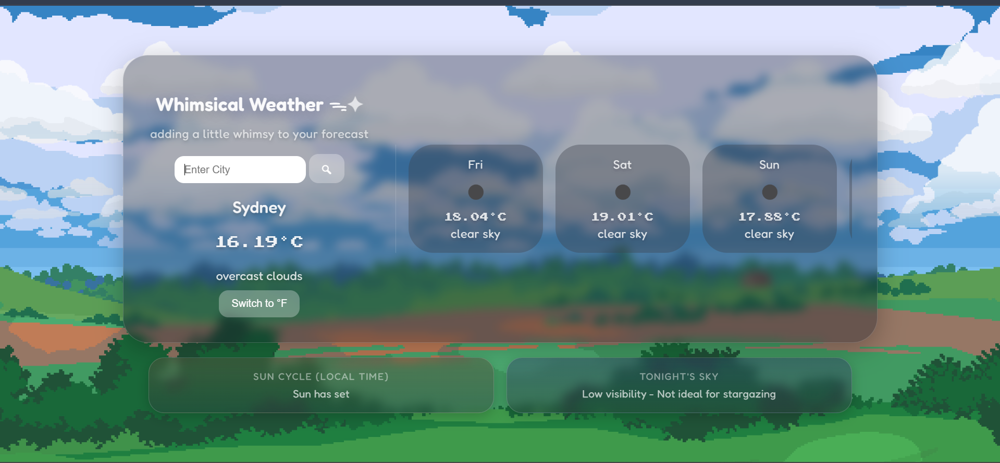
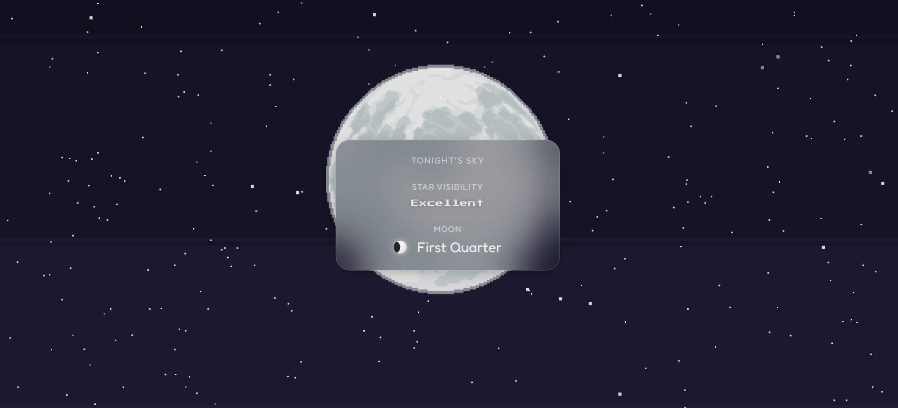
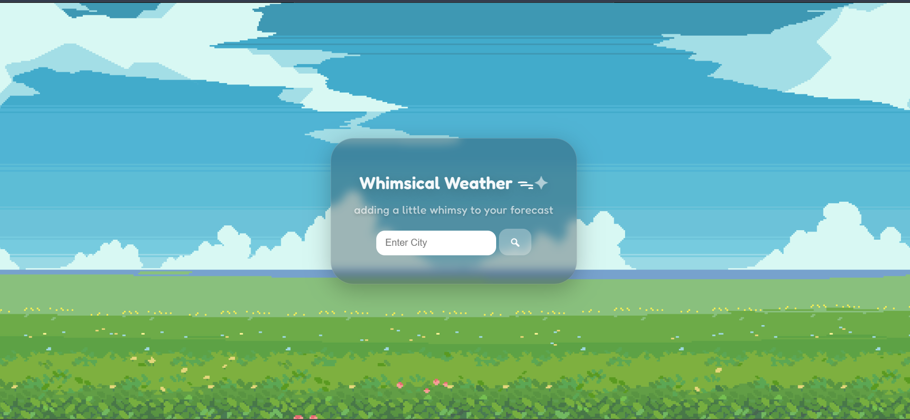

# Whimsical Weather - Interactive Weather & Stargazing Dashboard

A visually immersive weather dashboard that blends real-time forecasts with dynamic animations and astronomy insights.

**Live Demo:** https://whimsical-weather.onrender.com/  
*(may take a few seconds to load on first visit)*

### Description:
Enter any city around the world to view real-time weather conditions, a five-day forecast, local sunrise/sunset timings with countdowns, and night sky insights including stargazing conditions and moon phase visualization. Built using Python, HTML, CSS, and JavaScript.

### Application Preview

#### Weather Dashboard


#### Astronomy Module
[](assets/astronomy-demo.mp4)

#### Landing Page


### Features 

#### Weather System
- Real-time weather data (temperature, conditions, 5-day forecasts)
- Dynamic theming based on weather conditions and time of day
- Animated effects (rain, clouds, snow, lightning)

#### Solar Tracking
- Sunrise & sunset times
- Live countdown to next solar event
  
#### Night Sky Module
- Stargazing visibility rating system based on:
   - cloud coverage
   - weather conditions
   - time of day
- Moon phase visualization (CSS-based)
- Dynamic star field generation

#### UX & Interaction
- Temperature unit toggle (°C / °F with persistence)
- Glassmorphism UI with smooth animations

### Tech Stack 
- **Frontend:** HTML, CSS, JavaScript
- **Backend:** Python (Flask)
- **API:** OpenWeatherMap

### Key Concepts
- REST API integration and data handling
- DOM manipulation and event-driven UI updates
- State synchronization between backend data and frontend UI
- Conditional rendering based on time, weather and astronomy data
- CSS animations and pseudo-element techniques
- Dynamic theming systems
- UX design principles (progressive disclosure, visual hierarchy)
   
### Getting Started 
1. Clone the repository
2. Install dependencies ```pip install -r requirements.txt```
3. Run the app ```python app.py ```
4. Open ```http://127.0.0.1:5000``` in your browser

**Configuration**  
Create a .env file and add your API key:
```
API_KEY = your_weather_api_key
```

### Future Improvements 
- PWA support - making a mobile friendly, installable app
- Location-based weather auto detection
- Additional atmospheric integrations (light pollution, AQI, humidity, wind speed)
- More detailed astronomical data + events (constellations, planet visibility, meteor showers, etc.) 

### What I learned 
Working on this project strengthened my understanding of:
- API concepts + integration
- Building interactive UIs from real-time data
- Designing systems with multiple features interacting cohesively
- Balancing visual engagement and functionality in user interfaces

### Documentation
- [Architecture](./docs/architecture.md)
- [Feature Breakdown](./docs/features.md)

### License
This project is open-source and available under the MIT license.

### Credits
Background assets sourced from CraftPix.net, used under their free commercial license.
